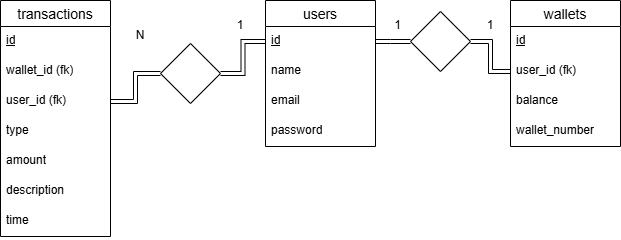

# TS Take Home Test Fulltack Dev

## Cara Menjalankan Aplikasi

### Backend

1. Masuk ke direktori mini-ewallet-be
2. Pastikan server lokal (Laragon atau XAMPP) sudah menyala
3. Buka terminal pada direktori tersebut ((windows) klik kanan area kosong pada direktori, pilih open in terminal)
4. Jalankan command `php artisan migrate:fresh --seed`
5. setelah *masdsadigration* selesai, kemudian jalankan command `php artisan serve`
### Frontend

1. Masuk ke direktori mini-ewallet-fe
2. Buka terminal pada direktori tersebut ( (**Windows**) klik kanan area kosong pada direktori, pilih *open in terminal*)
3. Jalankan command `npm run dev`

untuk akun yang dapat digunakan, ada empat akun dengan email sebagai berikut:
1. zmarquardt@example.net
2. jerry.runolfsdottir@example.com
3. leffler.anya@example.net
4. test@example.com
Password dari semua akun tersebut yaitu `password`

---
## Struktur Aplikasi

Aplikasi ini dibuat dengan menggunakan framework Vue.js 3 sebagai FrontEnd dan Laravel 13. Pada FrontEnd, aplikasi sederhana ini hanya memiliki tiga halaman, yaitu `HomePage`, `LoginPage`, dan `TransactionHistoryPage`. 

Pada `LoginPage`, user akan melihat modal sederhana yang berisi dua kolom input yaitu email dan password. Setelah user login, `token` dari Backend akan disimpan di `localStorage` dan user diarahkan menuju `HomePage`. 

Didalam `HomePage` user akan diberikan sambutan dan tampilan sederhana dari nominal saldo yang ada pada akunnya, serta nomor dompet dari akun user tersebut. Pada Sidebar ada dua menu navigasi yaitu `Home` dan `Transaction History`. User juga bisa menyembunyikan atau menampilkan saldo dan nomor rekening mereka

Pada halaman `Transaction History` user akan diberikan tabel tentang riwayat debit atau kredit saldo pada dompet mereka dengan paginasi.

Ketika user akan melakukan transfer saldo, ada beberapa validasi yang dijalankan di FE, yaitu
1. nominal harus lebih dari 0
2. saldo harus mencukupi
3. nomor wallet ada dan bukan nomor wallet sendiri

Jika ketiga syarat tersebut tidak terpenuhi, maka tombol send akan menjadi *disabled* dan akan kembali enabled hingga ketiga syarat tersebut dipenuhi.

Jika user melakukan transfer ke nomor *wallet* yang tidak terdaftar, maka aplikasi akan memunculkan *toast* error yang berisi pesan dari API atau pesan "Receiver not found" yang sudah disiapkan.

Kemudian pada Backend, disini terdapat 6 endpoint, diantaranya
- `/user/login` untuk login
- `/user` untuk mengambil data user
- `/user/dashboard` untuk mengambil data yang diperlukan di dashboard
- `/user/logout` untuk logout
- `/user/send` untuk transfer saldo
- `/user/transactions` untuk mengambil riwayat transaksi

Selain endpoint `/user/login`, endpoint-endpoint tersebut perlu melewati middleware autentikasi untuk bisa diakses.

---
## Skema Database

Berikut adalah skema DB dari aplikasi

Karena yang dibuat adalah aplikasi sederhana jadi tidak perlu menggunakan banyak tabel agar aplikasi dapat berjalan dengan lancar dan mengurangi resiko bug.

Tabel users memiliki kolom `id`, `name`, `email`, dan `password`. Setiap user bisa memiliki banyak transaksi namun user hanya bisa memiliki satu *wallet* saja.

Tabel transaksi memiliki kolom `ID`, dua kolom FK yaitu `wallet_id` dan `user_id`, kolom `type` dengan isinya antara *debit* atau *credit*, kolom `amount` yang merupakan nominal yang ada pada saat transaksi, kolom `description` yang isinya adalah *Receive transfer from {user}* jika *credit* atau *Transfer to {user}* jika *debit* dan kolom `time` yang isinya waktu transaksi terjadi

Tabel Wallet memiliki kolom ID, FK `user ID`, `balance` yang berisi nominal, dan `wallet_number` yang berisi nomor rekening dari user.

